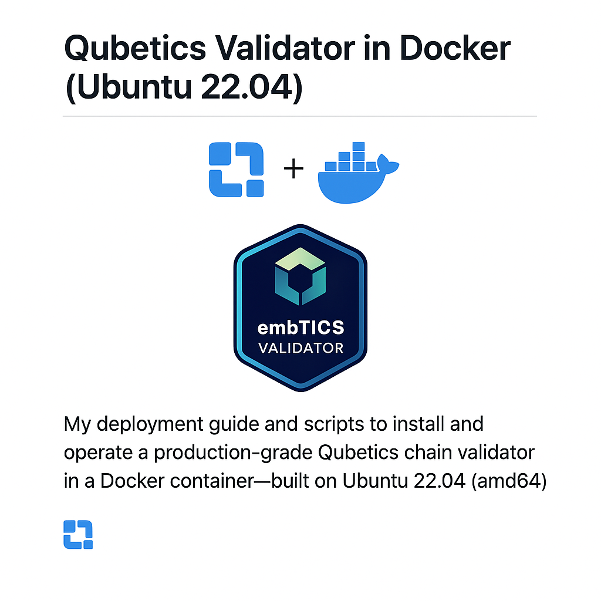

# embTICS Validator for Qubetics
[](https://t.me/embticsvalidator)



**🛡️ Why I Run My Qubetics Validator in Docker — and Why It Benefits You** 

Hey Qubetics fam 👋 — here’s why my validator node runs inside a Docker container, and why that matters for you as a delegator.

With 20+ years of experience in infrastructure, DevSecOps, cloud, and cybersecurity, I’ve built this validator for reliability, transparency, and uptime.

✅ Zero-Downtime Upgrades
Cosmovisor + Docker lets me apply upgrades without missing blocks — safely and cleanly.

🔐 Security by Design
Containerized setup with hardened isolation and controlled access.

📡 Live Monitoring + Telegram Alerts
Health checks and block sync alerts fire in real time — no guessing, no surprises.

💾 Backups + Portability
Mounted SSD, automated snapshots, and quick redeploys ensure data safety.

🔍 Open-Source Setup
Every line of my validator infrastructure is public and reproducible.
📂 GitHub: github.com/ericbannon/qubetics-ubuntu22.04-validator-docker

🗣️ Transparency First
You’re delegating to a validator that believes in openness and community trust.
Come chat or follow status updates in my channel:
👉 Join Telegram Updates @embticsvalidator

Thanks for supporting decentralization.
Let’s grow Qubetics together 🧱

# qubetics-ubuntu22.04-validator-docker 📦

## Description
This is a working example of a Dockerized deployment that leverages Ubuntu 22.04 to run the Qubetics Mainnet Validator Node on any cloud environment, or hardware. 

I will continue to pull from the upstream fork and make modifications to this repo to ensure validator-node enhancements continue to work in a Dockerized configuration and continual upgrades as they are released

**Image Repository:** https://hub.docker.com/repository/docker/bannimal/tics-validator-node/general 

The Docker Image will be updated with newer versions of qubeticsd and rebuilt with the same version tag. I.e. v1.0.2 will be next.

📣 Join the conversation in [Telegram](https://t.me/qubetics)

### Key notes

* Installs Go 1.22.4 which coscmovisor@v1.5.0 relies on
* Installs all prerequisites (eg. jq qget build-essential, etc..)
* Sets ENV for all required PATHS
* Leverages a modified qubetics_ubuntu_node.sh script that removes pre-requisite installations
* Modifies the qubetics_ubuntu_node.sh script to start the qubeticsd directly from cosmovisor since systemctl is not supported in Docker
* Can be run as amd64 on any ARM system (eg. raspberry pi 5) with qemu emulation enabled
* Creates a cosmovisor.log for viewing the block indexing in the background and to troubleshoot errors
* Setup script sets fase fees to .0001tics for best network performance (Per Qubetics reccomendation)
* Reboot systemd service for auto-start and upgrades 
* Additional scripts added for fast_sync to snapshotter 

## Reccomended Usage

**OPTION 1** (Reccomended)
Use the existing Docker image I will be maintaining across releases of the mainnet

**OPTION 2**
Build your own docker image as an amd64 image for x86 usage (ARM is not currently supported upstream) [Dockerfile Example](https://github.com/ericbannon/qubetics-ubuntu22.04-validator-docker/blob/main/Dockerfile)


## ✅ Prerequisites
### System Requirements

* Memory: At least 16GB RAM
* Storage: Minimum 500GB available disk space (SSD)
* CPU: 8-core minimum
* Network: Stable internet connection

### Node configuraton requirements

- SSD mounted at `/mnt/nvme`
- Domain name (e.g., `node.validator-tics.com`) - (You need to have your own external Domain name and A record pointed to you public IP for your router and port forwarding enabled on server)
- Port forwarding enabled on your router:
  - TCP 26656 (P2P)
  - TCP 26657 (RPC)
  - TCP 443 (HTTPS)
  - Optional: TCP 80 (redirect)
  - Reverse Proxy on your server (Using Caddy)

**IMPORTANT**: This assumes that you have mounted your desired storage partition as /mnt/nvme/ on your host system. If you have changed this, then your ubuntu setup script home directory will need to be changed accordingly.

## Docker Steps & Node Installation 🚀

Runs a background Docker container with the Qubetics configurations installed. 

* Mounts the DAEMON_HOME as your new data directory for where the blockchain will be managed. 
* Docker container has access to the host filesystem in privilieged mode
* Since you have downloaded the upgraded versions directly in the Docker image:
* Cosmovisor uses /mnt/nvme/qubetics/cosmovisor/genesis/bin/qubeticsd initially

Once block 175000 is reached, it switches to the upgrade binary in:
/mnt/nvme/qubetics/cosmovisor/upgrades/v1.0.1/bin/qubeticsd

#### Run the Docker Container in the Background 🧪

If running on an ARM based system:

```
docker run -dit \
  --platform=linux/amd64 \
  --name validator-node \
  --restart unless-stopped \
  --privileged \
  --network host \
  -v /mnt/nvme:/mnt/nvme \
  -e DAEMON_NAME=qubeticsd \
  -e DAEMON_HOME=/mnt/nvme/qubetics \
  -e DAEMON_ALLOW_DOWNLOAD_BINARIES=false \
  -e DAEMON_RESTART_AFTER_UPGRADE=true \
  -e DAEMON_LOG_BUFFER_SIZE=512 \
  bannimal/tics-validator-node:latest
```

If already running on x86 platform:

```
docker run -dit \
  --name validator-node \
  --restart unless-stopped \
  --privileged \
  --network host \
  -v /mnt/nvme:/mnt/nvme \
  -e DAEMON_NAME=qubeticsd \
  -e DAEMON_HOME=/mnt/nvme/qubetics \
  -e DAEMON_ALLOW_DOWNLOAD_BINARIES=false \
  -e DAEMON_RESTART_AFTER_UPGRADE=true \
  -e DAEMON_LOG_BUFFER_SIZE=512 \
  bannimal/tics-validator-node:latest
``` 

**IMPORTANT** - If you completely remove the docker container from the node, you will need to specify the backup directory when re-running your docker run command for the new container. You can do this by adding the following env variable to your docker run command (replace with current month and day)

```
 -e DAEMON_DATA_BACKUP_DIR=/mnt/nvme/qubetics/data-backup-2025-7-27 \
  bannimal/tics-validator-node:v1.0.1
```

**Reccomended** If you are running an independent node for the purpose of validation and want the docker container to have system access to all CPUs and RAM, please include the following in your run command:

```
    -cpus="$(nproc)" \
    --memory="0" \
```

#### Install Qubetics Validator Node
```
bash -x qubetics_ubuntu_node.sh
```

Enter in your node details and proceed to make note of any of the outpout - mnemonics & Node information. Store somewhere safe and secure.

#### Useful commands to retrive Node Info

##### Get Tendermint Validator Public Key
```
$DAEMON_NAME tendermint show-validator --home $DAEMON_HOME
```
##### Get Node ID
```
$DAEMON_NAME tendermint show-node-id --home $DAEMON_HOME
```
##### Get Bech32 Wallet Address 
```
$DAEMON_NAME keys show $KEYS --keyring-backend $KEYRING --home $DAEMON_HOME -a
```

## Viewing logs & Troubleshooting 🔍

To view live logs for cosmovisor and your validator node you can run the following:

```
tail -f /mnt/nvme/qubetics/cosmovisor.log
```

# Concluding Notes 

Since you have started the Docker container in the background using the "-d" flag, you can safely exit the running container and the qubeticsd service will continue to run.

## See host-utilities README.md 🔧
Instructions on Auto-Upgrades and Safe Reboot in [Host Utilities README](./host-utilities/README.md)

## See validator-metrics README.md 📊
Utilities for measuring block sync metrics and other performance metrics in [validator-metrics README](./validator-metrics/README.md)


